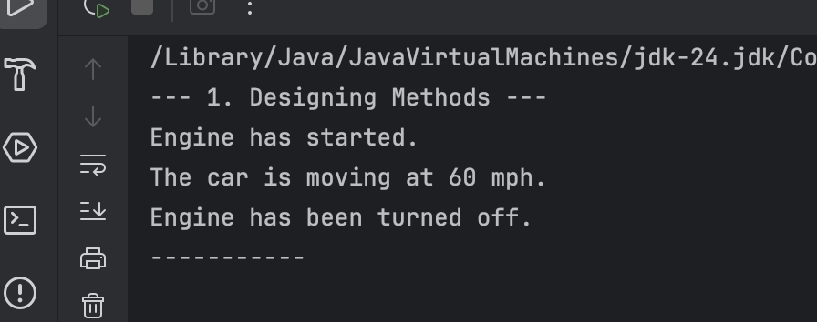
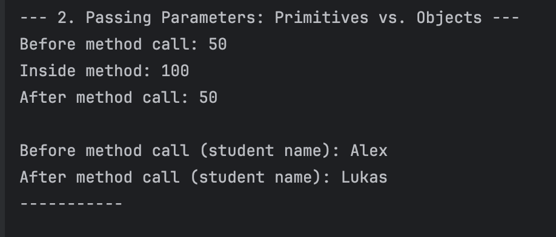
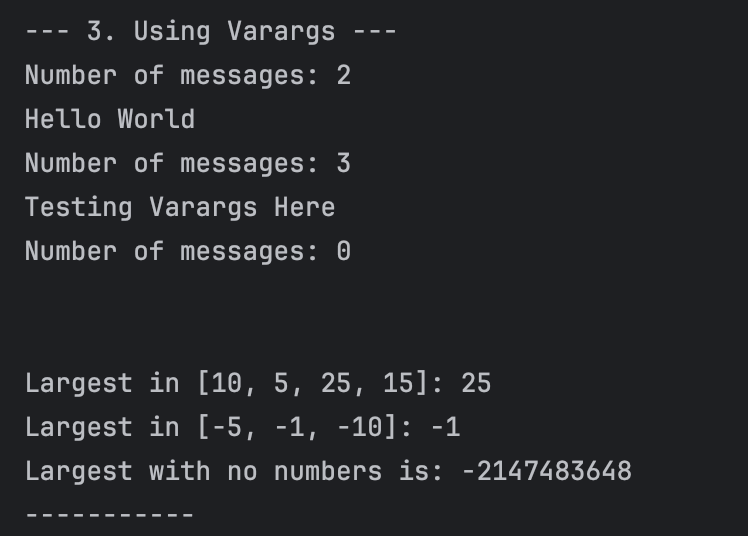
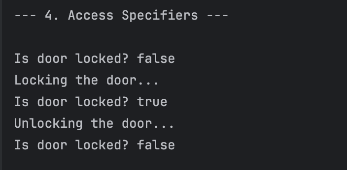
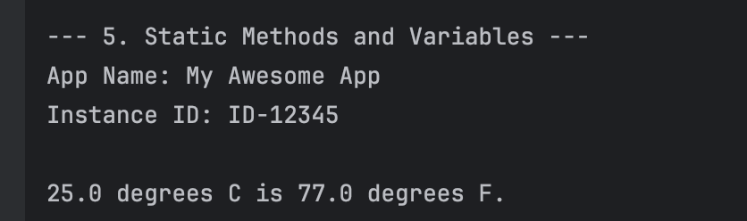
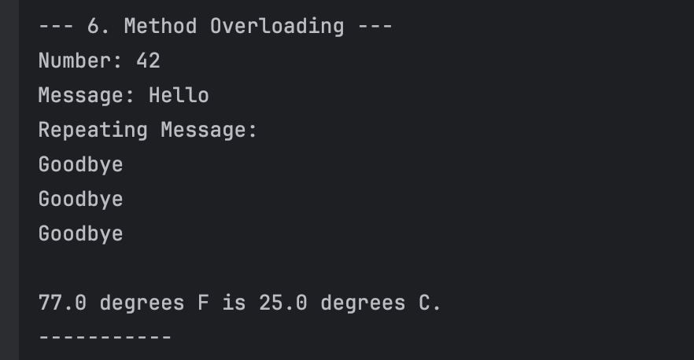
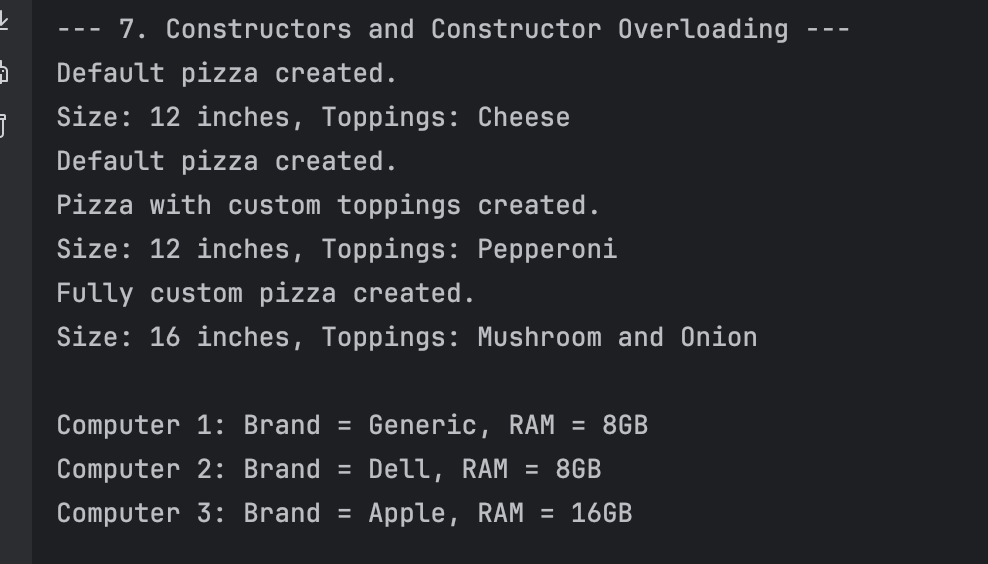
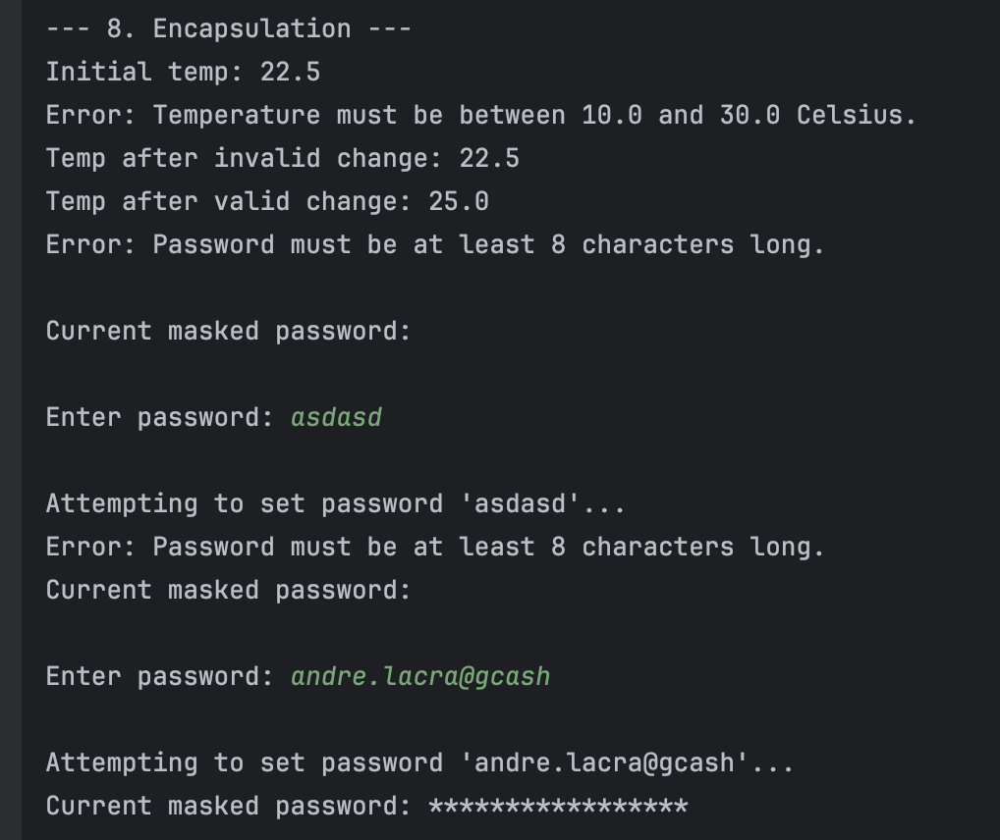

# Mastering Methods and Encapsulation
**Name:** Andre Dominic Ha Lacra

---

## Output Screenshots and Mini Challenges

---

### Exercise 1: Designing Methods

**Output Screenshot:**  

---

### Exercise 2: Passing Parameters: `Primitives` vs. `Objects`

**Output Screenshot:**  

---

### Exercise 3: Using `Varargs`

**Output Screenshot:**  

---

### Exercise 4: Access Specifiers

**Output Screenshot:**  

---

### Exercise 5: Static `Methods` and `Variables`

**Output Screenshot:**  

---

### Exercise 6: Method Overloading

---

### Exercise 7: Constructors and Constructor Overloading

**Output Screenshot:**  

---

### Exercise 8: Encapsulation

**Output Screenshot:**  

---
